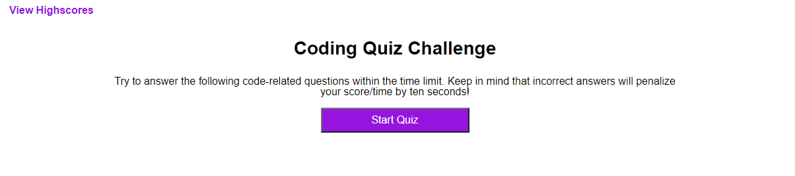
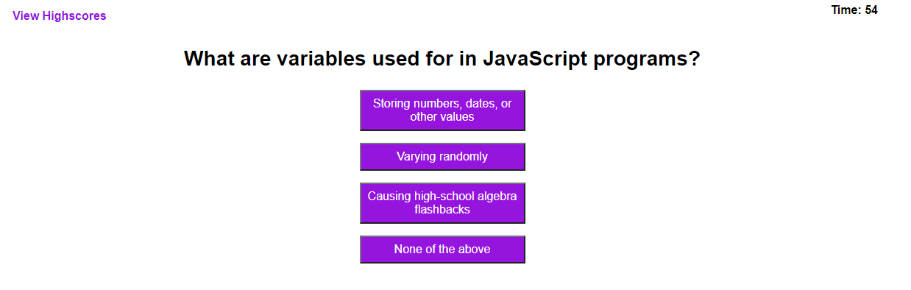
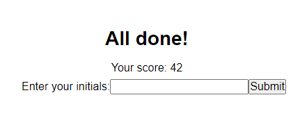
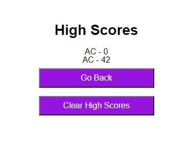

# Timed-Coding-Quiz
## Description
This project aims to create a timed, multiple-choice coding quiz built utilizing dynamically updated HTML and CSS powered by JavaScript. In it, you will be able to:

- Answer a short series of multiple-choice questions
- Save your score with your initials
- View current high scores
- Clear existing high scores

## Deployment
To view the deployed and current project: https://accoon.github.io/Timed-Coding-Quiz/

## Usage
Click the Start button to begin taking the quiz!

Once you click the button, the quiz starts. You will have 60 seconds to answer the upcoming questions by clicking one of the provided answers. Your time is visible in the top-right corner of the window shortly after you begin the quiz.

Whenever you answer a question, you'll see whether you answered correctly or not beneath the answer list. In addition, if you answered incorrectly, then you'll lose ten seconds on the timer.

Once all the questions have been answered, or if time runs out, you'll see your score and a box to submit your initials as part of the high scores. Your score is based on how much time is left!

If you submit your score, you'll see a list of the currently-recorded scores so far, including your most recent score. You can also access this page any time by clicking on View Highscores in the top-left corner.

From here, you can either click the Go Back button to go back to the quiz starting screen, or you can click the Clear High Scores button to clear the current scores list.

## Upcoming
The styling is currently very lacking on this application. I plan to pour more work into touching up the styles as well as refactoring the JavaScript to more efficiently handle page elements in future updates.

## Credit
The questions and answers used in this application were taken from http://mcqspdfs.blogspot.com/2013/08/60-top-javascript-multiple-choice.html